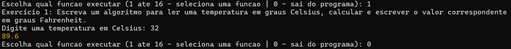

# Atividade 1: lista de exercícios em JavaScript

## Tecnologias utilizadas no desenvolvimento
<div align="center">
	<code></code>
	<code></code>
	<code></code>
</div>

Essa lista contém 16 exercícios de lógica de programação, todos resolvidos em JavaScript e testados no ambiente Node.js.

Os exercícios:

1. Escreva um algoritmo para ler uma temperatura em graus Celsius, calcular e escrever o valor correspondente em graus Fahrenheit.
2. Escreva um algoritmo para ler o número de eleitores de um município, o número de votos brancos, nulos e válidos. Calcular e escrever o percentual que cada um representa em relação ao total de eleitores.
3. Faça um algoritmo que leia quatro números inteiros e realize as seguintes operações:

   - Some 25 ao primeiro inteiro;
   - Triplique o valor do segundo inteiro;
   - Modifique o valor do terceiro inteiro para 12% do valor original;
   - Armazene no quarto inteiro a soma dos valores originais (os que o usuário digitou) dos primeiros três inteiros.
4. Escreva um algoritmo para ler as notas das duas avaliações de um aluno no semestre, calcular e escrever a média semestral e a seguinte mensagem: ‘PARABÉNS! Você foi aprovado’, somente se o aluno foi aprovado (considere 6.0 a nota mínima para aprovação).
5. Acrescente ao exercício acima a mensagem ‘Você foi REPROVADO! Estude mais’ caso a
   média calculada seja menor que 6,0.
6. Ler três valores para os lados de um triângulo: A, B e C. Verificar se os lados fornecidos formam realmente um triângulo. Caso forme, deve ser indicado o tipo de triângulo: Isósceles, escaleno ou eqüilátero.

7. As maçãs custam 0,30 se forem compradas menos do que uma dúzia, e 0,25 se forem compradas pelo menos doze. Escreva um algoritmo que leia o número de maçãs compradas, calcule e escreva o valor total da compra.

8. Escreva um algoritmo para ler 2 valores (considere que não serão lidos valores iguais) e escreve-los em ordem crescente.
9. Escreva um algoritmo que leia o código de origem de um produto e imprima a região do mesmo, conforme a tabela abaixo:

   | Código de origem    | Região             |
   | ------------------- | ----------------- |
   | 1                   | Sul               |
   | 2                   | Norte             |
   | 3                   | Leste             |
   | 4                   | Oeste             |
   | 5 ou 6              | Nordeste          |
   | 7, 8 ou 9           | Sudeste           |
   | 10 até 20           | Centro-Oeste      |
   | 25 até 50           | Noroeste          |
   | Fora dos intervalos | Produto importado |
10. Escreva um algoritmo para ler um número inteiro e escrevê-lo na tela 10 vezes
11. Escreva um algoritmo para ler uma quantidade indeterminada de valores inteiros. Para cada valor fornecido escrever uma mensagem que indica se cada valor fornecido é PAR ou ÍMPAR. O algoritmo será encerrado imediatamente após a leitura de um valor NULO ou NEGATIVO.
12. Escreva um algoritmo que gere os números de 1000 a 1999 e escreva aqueles que, divididos por 11, dão resto igual a 5.
13. Escrever um algoritmo que leia 5 valores para uma variável N e, para cada um deles, calcule e mostre a tabuada de 1 até N. Mostre a tabuada na forma:
1 x N = N
2 x N = 2N
3 x N = 3N
14. Fazer um algoritmo para receber números decimais até que o usuário digite 0 e fazer a média aritmética desses números.
15. Fazer um algoritmos para receber um número decimal e o peso de cada número até que o usuário digite o número 0. Fazer a média ponderada desses números e pesos respectivos.
16. Escreva um algoritmo para imprimir os 50 primeiros número primos maior que 100.

## Execução dos exercícios

### Requisitos
Para executar os exercícios, é necessário ter em sua máquina: 
- Node.js (obrigatório) - Ambiente de execução JavaScript;
- Git (opcional) - Para clonar o repositório (pode baixar o ZIP);
- VSCode (opcional) - Para editar o código e melhor visualização.

### Como executar
1. Clonar o repositório clicando no botão verde escrito "<>Code" e selecionar a opção "Download ZIP" para baixar o ZIP do repositório ou utilizar o comando abaixo:
```bash
   git clone https://github.com/bernardobru/atividades_curso_maisprati.git
```
2. Abrir a pasta onde está o repositório no terminal do seu computador ou entrar nela pelo terminal com o comando abaixo:
```bash
   cd caminho/para/pasta/atividades_curso_maisprati/atividade01 
```
3. Executar o comando abaixo para instalar as dependências:
```bash
   npm install
```
4. Executar o comando abaixo para executar os exercícios:
```bash
   node main.js
```
 
### A execução

Ao executar, aparecerá no terminal a mensagem: 
```
   Escolha qual funcao executar (1 ate 16 - seleciona uma funcao | 0 - sai do programa):
```
Para selecionar qual exercício você deseja executar, basta selecionar um número entre 1 a 16, para interromper a execução do programa, digite qualquer coisa e aperte enter.

### Exemplos
Execução do programa:


## Dependências

A unica dependência é a lib [readline-sync](https://github.com/anseki/readline-sync), utilizada para receber entradas do usuário.